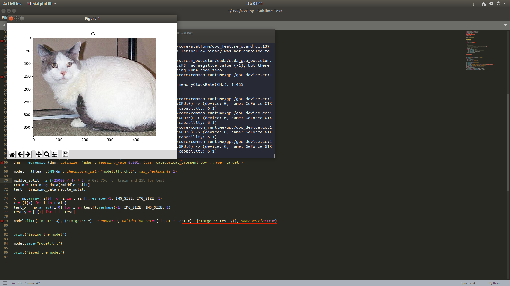

# Dogs versus Cats

A deep neural network that 'learns' to distinguish between a cat and a dog.
# Data
You can get the that this DNN has been trained on from
[Kaggle](https://www.kaggle.com/c/dogs-vs-cats/data)

# Examples:

